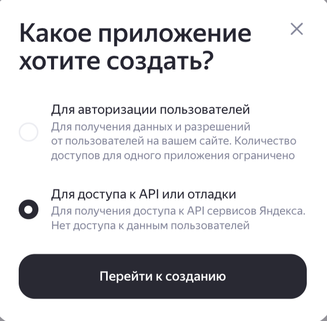
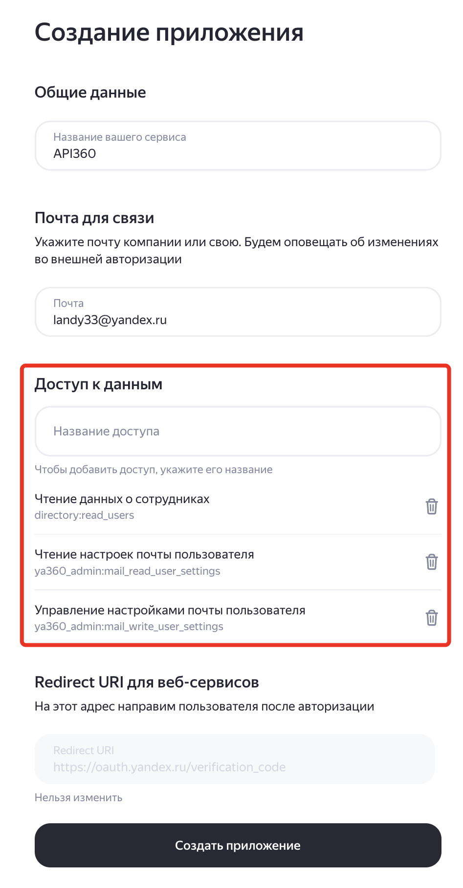

# Документация по скрипту y360_contacts.py

## Описание

Скрипт предназначен для управления личными контактами пользователей в Яндекс 360 через CardDAV API. Позволяет выполнять массовые операции с контактами для нескольких пользователей одновременно.
Краткое описание сценариев использования:
- удаление всех личных контактов по списку пользователей;
- удаление выделенных контактов, email которых совпадает с указанным шаблоном (если у контакта только один email адрес) или удаление только email (который совпадает с указанным шаблоном), если у контакта несколько email адресов;
- модификация email адресов контактов по заранее заданным шаблонам;
- выгрузка контактов в файл в формате vcf для выбранных пользователей;
- отображение статуса автоматического сбора контактов в настройках профиля пользователя в Яндекс 360;
- модификация статуса автоматического сбора контактов для пользователя (enable, disable).

> [!NOTE]
> В программе есть три способа указать списка пользователей для модификации/поиска:
> - вручную (через пробел или запятую), при вызове конкретного пункта меню (используется для ввода небольшого количества пользователей), логины вводятся через пробел или запятую;
> - через CSV файл, в котором указывается логин|email пользователей (при массовой модификации), в этом случае указывается параметр `!` в запросе списка пользователей.
> - указать, что действие необходимо произвести для всех пользователей организации, в этом случае указывается параметр `*` в запросе списка пользователей.

## Требования

- Python 3.10+
- Пакеты из `requirements.txt`
- OAuth токен с необходимыми правами доступа
- Сервисное приложение для получения токенов пользователей

## Настройка

### Параметры конфигурации

Создайте файл `.env` в директории со скриптом со следующими параметрами:

| Параметр | Описание | Обязательный | Пример |
|----------|----------|--------------|--------|
| OAUTH_TOKEN | Основной токен для работы срипта | Да | Буквенно-цифровой код |
| ORG_ID | Идентификатор организации Яндекс 360 | Да | 7 цифр |
| SERVICE_APP_ID | Идентификатор сервисного приложения | Да | Буквенно-цифровой код |
| SERVICE_APP_SECRET | Секрет сервисного приложения | Да | Буквенно-цифровой код |
| USERS_FILE | Файл (относительный или полный путь) для загрузки списка пользователей | Нет | Значение по умолчанию - users.csv |
| VCARD_FOLDER | Папка для выгрузки файлов vcf с данными контактов запрошенных пользователей | Нет | Значение по умолчению - vcard |
| CONTACT_COLLECT_STATUS_BASE_NAME | Часть имени файла, в который будет выгружаться статус автоматического сбора контактов | Нет | Значение по умолчению - collect_status |
| DRY_RUN | Выполнить тестовый прогон, не модифицировать данные | Нет | Значение по умочанию - false |

> [!WARNING]
> Обязательно проверьте правильный путь к каталогу VCARD_FOLDER, в Windows среде либо оставьте название только каталога, или укажите обратный слэш для описания относительного пути - `.\vcard`

### Требования к запуску скрипта со стороны Яндекс 360 API
Для работы скрипта необходимо:
1. Получить токен OAuth для чтения данных организации Яндекс 360 через API.
2. Настроить серввисное приложение для возможности подключаться к ящикам пользователей через протокол IMAP.

#### Получание токена OAuth для работы с данными Яндекс 360

. Для использования приложения необходимо сгенерировать OAuth токен для аутентификации в Yandex 360 API. Токен должен содержать необходимые права для выполнения операций управления ресурсами в организации Yandex 360. Документация - [Создание приложения](https://yandex.ru/dev/id/doc/ru/register-client).

Последовательность шагов для создания токена:
* перейдите на https://oauth.yandex.ru/client/new/. Аутентифицируйтесь от имени администратора организации Yandex 360
* В предлагаемом окне выберите "Для доступа к API или отладке" и нажмите "Перейти к созданию".



* заполните поля в форме создания приложения:
  - поле "Название вашего сервиса" - любое название
  - проверьте почту для связи

* добавьте разрешения для токена. Для этого в разделе "Доступ к данным" найдите и добавьте следующие разрешения:

| Название разрешения | Что можно делать |
|-------------------|------------------|
| directory:read_users | читать атрибуты пользователей |
| ya360_admin:mail_read_user_settings  | Читать настройки почты польльзователей |
| ya360_admin:mail_write_user_settings | Изменять настройки почты пользователей |



* нажмите кнопку "Создать приложение"
* закройте окно с предложением пройти верификацию через Госуслуги
* в новом окне "Мои приложения" отображаются свойства созданного приложения. Найдите раздел с ID созданного приложения и скопируйте строку из поля "ClientID":


* в текстовом редакторе создайте строку вида `https://oauth.yandex.ru/authorize?response_type=token&client_id=<ID приложения>` и вставьте скопированное значение ClientID из предыдущего шага вместо `<ID приложения>`

Вставьте получившуюся ссылку в браузер и нажмите "Enter".
* в окне браузера появляется запрос на подтверждение прав токена. Подтверждение **необходимо выполнить от учётной записи ВЛАДЕЛЬЦА организации** (если это сделать от имени обычного пользователя, токен не получит запрашиваемые права из-за отсутствия необходимых разрешений у данного пользовательского аккаунта).
Нажмите "Войти как" и получите необходимый токен доступа.

> [!WARNING]
> Скопируйте токен и сохраните его в безопасном месте.

2. Получите ID организации в Yandex 360. Для этого перейдите в [консоль администрирования](admin.yandex.ru) и в левом нижнем углу интерфейса будет необходимый номер.


3. Запишите полученные на предыдущем шаге OAuth токен и Org ID в соответствующие переменные в файле `.env` в том же каталоге, что и сами скрипты.

#### Настройка сервисного сервисного приложения Яндекс 360 API для запуска скрипта
> [!WARNING]  
> Настройка сервисного приложения доступна только для учётной записи ВЛАДЕЛЬЦА организации Яндекс 360. Прав администратора для выполнения нижеописанных действий недостаточно!

Скрипт для доступа к содержимому почтового ящика пользователя использует технологию [сервисных приложений в Яндекс 360](https://yandex.ru/support/yandex-360/business/admin/ru/security-service-applications). 
По данной инструкции необходимо:
1. Создать основное OAuth приложение с правами (если вы выполнили предыдущий этап получения OAuth токена, то такое приложение и токен для него у вас уже есть):
    - ya360_security:service_applications_read
    - ya360_security:service_applications_write
2. Сгенерировать для данного приложения токен, который будет использоваться в переменной среды `OAUTH_TOKEN_ARG`. Генерация токена происходит в браузере с обязательной аутентификацией в Яндекс 360 учётной записью владельца организации (если вы выполнили предыдущий этап получения OAuth токена, то такое приложение и токен для него у вас уже есть).
3. Активировать функицонал сервисных приложений с помощью вызова API (используя ранее полученный токен).
4. Создать ёще одно OAuth (сервисное) приложение с правами:
    - addressbook:all
5. Сохранить `ID` сервисного приложения и `Secret` (они будут использоваться в переменных среды `APPLICATION_CLIENT_ID_ARG` и `APPLICATION_CLIENT_SECRET_ARG`).
6. Используя Яндекс 360 API, внести идентификатор нового приложения в список сервисных приложений на уровне системы Яндекс 360.

## Установка

> \[!WARNING\]  
> Далее все рекомендации по установке и настройке среды описваются для последней версии Python (протестировано на 3.12.4). Если у вас другая версия, поступайте в соответствии с вашей конфигурацией.

1. **Установите Python**: Требуется Python 3.10 или выше. Установщик - ([Download Python](https://www.python.org/downloads/))
2. (Опциоанально) Использовать виртуальную среду для работы программы. Для этого:
    * В коммандной строке установите инструмент создания виртуальной среды - `pip install virtualenv`
    * Переходим в каталог, где находится скрипт для запуска, и выполняем команду создания каталога для поддержки вирутальный среды Python для этого проекта - `python3 -m venv .venv`. Это создаст в текущем каталоге новый каталог `.venv` со своей служебной структурой.
    * Перед запуском скрипта необходимо активировать виртуальную среду для его выполнения. Для этого выполняем команду:
        - в MacOS, Linux - `source .venv/bin/activate`
        - в Windows - в каталоге `.venv\Scripts` есть несколько файлов:
            - `activate.ps1` - для активации через Powershell;
            - `activate.bat` - для активации через CMD.
    * После выполнения программы для выхода из вигруального окружения нужно:
        * в MacOS выполнить команду `deactivate`
        * В Windows выполнить команду `.venv\Scripts\deactivate.bat`
3. **Установите зависимости**:
   Если было активировано вирутальное окружение для Python, то все зависимости будут установлены в эту вирутальную среду, иначе зависимости будут установлены глоабльно.
   Скрипт требует следующие Python-пакеты:
   - `python-dotenv`: Для загрузки переменных окружения из `.env`.
   - `requests`: Для HTTP-запросов к API Yandex 360.
   - `urllib3`: Для работы с HTTP запросами.

   Установите их с помощью:
   ```bash
   pip install python-dotenv requests urllib3
   ```
   или
   ```bash
   pip install -r requirements.txt
   ```

> \[!WARNING\]  
> Если вы создали вирутальную среду для выполнения скрипта и установили зависимости Python в эту вирутальную среду, то для каждого нового запуска скрипта убедитесь, что они запускается в активированной вирутальной среде - иначе python не будет находить необходимые пакеты для работы.

## Режимы работы

Скрипт работает в интерактивном режиме с меню. После запуска доступны следующие опции:

### 1. Выгрузка пользователей в файл

**Описание:** Выгружает всех пользователей организации из API Яндекс 360 в CSV файл.

**Формат выходного файла:** CSV с разделителем `;` содержит все атрибуты пользователя, возвращаемые API.

**Использование:**
```bash
python y360_contacts.py
# Выберите опцию 1
```

**Результат:** Создается файл, указанный в параметре `USERS_FILE` (по умолчанию `users.csv`).

Пример выгружаемого файла с атрибутами пользователей в Я360:
```bash
id;nickname;departmentId;email;name;gender;position;avatarId;about;birthday;contacts;aliases;groups;externalId;isAdmin;isRobot;isDismissed;isEnabled;isEnabledUpdatedAt;timezone;language;createdAt;updatedAt
1130000069000000;nikita;1;nikita@domain.ru;{'first': 'Никита', 'last': 'Кравцов', 'middle': ''};male;;;;;[{'type': 'staff', 'value': 'https://staff.yandex.ru/nikita?org_id=8023551&uid=1130000069000000', 'main': False, 'alias': False, 'synthetic': True}, {'type': 'email', 'value': 'nikita@domain.ru', 'main': True, 'alias': False, 'synthetic': True}];[];[];;False;False;False;True;;Europe/Moscow;ru;2025-07-20T18:26:17.885Z;2025-10-24T10:32:06.480Z
1130000070000000;petrov;1;petrov@domain.ru;{'first': 'Иван', 'last': 'Петров', 'middle': 'Николаевич'};male;Реководитель отдела внедрения;;;;[{'type': 'phone', 'value': '+7 (903) 001-12-34', 'main': False, 'alias': False, 'synthetic': False}, {'type': 'phone', 'value': '+7 (903) 002-00-01', 'main': False, 'alias': False, 'synthetic': False}, {'type': 'staff', 'value': 'https://staff.yandex.ru/petrova?org_id=8023551&uid=1130000070000000', 'main': False, 'alias': False, 'synthetic': True}, {'type': 'email', 'value': 'petrov@domain.ru', 'main': True, 'alias': False, 'synthetic': True}, {'type': 'email', 'value': 'petrov@domain.ru', 'main': False, 'alias': True, 'synthetic': True}];['petrov'];[];;False;False;False;False;2025-11-06T10:00:49.134Z;Europe/Moscow;ru;2025-09-05T14:51:24.126Z;2025-10-24T10:32:08.323Z
```

---

> \[!WARNING\]  
> Во всех остальных сценариях работы скрипта данный файл можно использовать как входной список пользователей для выполнения операций. Для этого можно использовать его как есть (в оригинальном виде, как он был сохранен, либо упростить до такой формы:
>```bash
> email
> nikita@domain.com
> petrov
> ```
> **В этом случае случае в первой строке файла должна быть строка `email`, это заголовок колонки в CSV файле**

### 2. Удаление всех контактов выбранных пользователей

**Описание:** Полностью удаляет все личные контакты указанных пользователей.

**Варианты ввода пользователей:**

#### Вариант 1: По алиасу (nickname)
```
Enter users aliases or uid or last name: ivanov
```

#### Вариант 2: По нескольким алиасам (через запятую, пробел или точку с запятой)
```
Enter users aliases or uid or last name: ivanov, petrov sidorov
```

#### Вариант 3: По UID пользователя (16-значный идентификатор, начинающийся с 113)
```
Enter users aliases or uid or last name: 1130000000000001
```

#### Вариант 4: По фамилии
```
Enter users aliases or uid or last name: Иванов
```
**Внимание:** Если несколько пользователей имеют одинаковую фамилию, скрипт выведет список и попросит уточнить запрос.

#### Вариант 5: По email (без домена или с доменом)
```
Enter users aliases or uid or last name: ivanov@company.ru
# или
Enter users aliases or uid or last name: ivanov
```

#### Вариант 6: Все пользователи организации
```
Enter users aliases or uid or last name: *
```

#### Вариант 7: Загрузка из файла
```
Enter users aliases or uid or last name: !
```
Загружает email адреса из файла, указанного в `USERS_FILE`.

**Примеры комбинированного ввода:**
```
ivanov petrov 1130000000000001 Сидоров
ivanov@company.ru, petrov sidorov
```

**Подтверждение операции:**
```
Confirm removal of all contacts for 3 users? (y/n): y
```

**Режим DRY_RUN:**
При установке `DRY_RUN=true` операция не выполняется, только выводится список контактов для удаления.

---

### 3. Удаление контактов по шаблонам email

**Описание:** Удаляет из контактов пользователей только те email адреса, которые соответствуют заданным шаблонам.

**Варианты ввода пользователей:** См. раздел "Удаление всех контактов" выше.

**Форматы шаблонов для удаления email:**

#### Шаблон 1: Точный email адрес
```
Enter email templates to delete: test@example.com
```
Удалит точное совпадение `test@example.com`.

#### Шаблон 2: Все адреса в домене
```
Enter email templates to delete: *@example.com
```
Удалит все адреса с доменом `example.com` (например: `user@example.com`, `admin@example.com`).

#### Шаблон 3: Все адреса в поддоменах
```
Enter email templates to delete: *.example.com
```
Удалит все адреса с поддоменами `example.com` (например: `user@mail.example.com`, `admin@hr.example.com`).

#### Шаблон 4: Конкретный алиас в любом домене
```
Enter email templates to delete: admin@*
```
Удалит все адреса с алиасом `admin` в любом домене (например: `admin@example.com`, `admin@test.ru`).

#### Шаблон 5: Только домен (без @)
```
Enter email templates to delete: example.com
```
Удалит все адреса с доменом `example.com`.

#### Шаблон 6: Несколько шаблонов
```
Enter email templates to delete: *@example.com test@*.ru admin@*
```
Можно указывать несколько шаблонов, разделяя их пробелами, запятыми или точками с запятой.

**Валидация шаблонов:**
Разрешены только символы: буквы, цифры, точка (`.`), дефис (`-`), собака (`@`) и звездочка (`*`).

**Логика работы:**
- Если в контакте только один email и он соответствует шаблону - контакт удаляется полностью
- Если в контакте несколько email - удаляются только совпадающие адреса, контакт остается

**Пример:**
```
Enter users: ivanov petrov
Found 2 users to delete emails from.

Enter email templates to delete: *@old-domain.com *.temp.com
Confirm removal of matching email entries from contacts of 2 users? (y/n): y
```

---

### 4. Замена email адресов в контактах

**Описание:** Заменяет email адреса в контактах пользователей по заданному шаблону.

**Варианты ввода пользователей:** См. раздел "Удаление всех контактов" выше.

**Форматы шаблонов для замены:**

Ввод осуществляется в формате: `<шаблон_поиска> <шаблон_замены>`

#### Пример 1: Замена домена
```
Введите через пробел два выражения: *@old.com *@new.com
```
**Результат:**
- `user@old.com` → `user@new.com`
- `admin@old.com` → `admin@new.com`

#### Пример 2: Замена поддомена
```
Введите через пробел два выражения: *@mail.old.com *@new.com
```
**Результат:**
- `user@mail.old.com` → `user@new.com`

#### Пример 3: Замена алиаса
```
Введите через пробел два выражения: old-*@domain.com new-*@domain.com
```
**Результат:**
- `old-user@domain.com` → `new-user@domain.com`
- `old-admin@domain.com` → `new-admin@domain.com`

#### Пример 4: Сложная замена с несколькими wildcard
```
Введите через пробел два выражения: *@*.old.com *@*.new.com
```
**Результат:**
- `user@mail.old.com` → `user@mail.new.com`
- `admin@hr.old.com` → `admin@hr.new.com`

#### Пример 5: Замена с перестановкой
```
Введите через пробел два выражения: *-*@domain.com *.*@domain.com
```
**Результат:**
- `first-second@domain.com` → `first.second@domain.com`

**Правила работы wildcard (*):**
- `*` в шаблоне поиска захватывает любую последовательность символов
- `*` в шаблоне замены заменяется на захваченное значение
- Если в шаблонах несколько `*`, они сопоставляются по порядку

**Валидация:**
- Шаблоны должны содержать только буквы, цифры, точку, дефис, @ и *
- Оба шаблона обязательны
- Шаблоны не должны быть пустыми

**Подтверждение:**
```
Подтвердите замену email по шаблону '*@old.com' -> '*@new.com' для 5 пользователей? (y/n):
```

---

### 5. Экспорт контактов в VCF

**Описание:** Сохраняет личные контакты пользователей в VCF файлы (формат vCard).

**Варианты ввода пользователей:** См. раздел "Удаление всех контактов" выше.

**Формат выходных файлов:**
- Имя файла: `{алиас}_{timestamp}.vcf`
  - Пример: `ivanov_260114_143025.vcf`
- Формат timestamp: `YYMMDD_HHMMSS`
- Директория: указывается в параметре `VCARD_FOLDER` (по умолчанию: `vcard`)

**Содержимое:**
- Один VCF файл на пользователя
- Содержит все контакты из личной адресной книги
- Формат vCard 3.0/4.0 (в зависимости от источника)

**Использование:**
```
Enter users: ivanov petrov sidorov
Found 3 users to export contacts for.

Сохранить контакты для 3 пользователей в каталог 'vcard'? (y/n): y

[ivanov@company.ru] Экспортировано 45 контактов в vcard/ivanov_260114_143025.vcf
[petrov@company.ru] Экспортировано 32 контакта в vcard/petrov_260114_143025.vcf
[sidorov@company.ru] Контактов не найдено, экспорт пропущен.

Экспорт завершен. Создано файлов: 2. Всего контактов выгружено: 77
```

**Примечания:**
- Экспортируются только личные контакты (addressbook "Personal")
- Если у пользователя нет контактов, файл не создается
- Файлы создаются с кодировкой UTF-8

---

### 6. Выгрузка статуса автосбора контактов

**Описание:** Выгружает информацию о статусе автоматического сбора контактов для выбранных пользователей.

**Варианты ввода пользователей:** См. раздел "Удаление всех контактов" выше.

**Формат выходного файла:**
- Имя файла: `{базовое_имя}_{timestamp}.csv`
  - Пример: `collect_status_260114_143025.csv`
- Формат: CSV с разделителем `;`
- Кодировка: UTF-8

**Структура CSV:**
```csv
email;collectAddresses
ivanov@company.ru;True
petrov@company.ru;False
sidorov@company.ru;True
```

**Поля:**
- `email` - email адрес пользователя
- `collectAddresses` - статус автосбора (True/False)

**Использование:**
```
Enter users: *
Saved collectAddresses status for 150 users to collect_status_260114_143025.csv
Export completed successfully.
```

---

### 7. Включение автосбора контактов

**Описание:** Включает автоматический сбор контактов для выбранных пользователей.

**Варианты ввода пользователей:** См. раздел "Удаление всех контактов" выше.

**Что делает:**
- Устанавливает параметр `collectAddresses` в `true` для почтовых настроек пользователя
- После включения, email адреса из входящих/исходящих писем автоматически добавляются в личную адресную книгу

**Использование:**
```
Enter users: ivanov petrov
Change auto-collect contacts to enable for 2 users? (y/n): y

Success - collectAddresses set to True for user 1130000000000001
Success - collectAddresses set to True for user 1130000000000002
Changed auto-collect to enable for 2 of 2 users.
```

---

### 8. Отключение автосбора контактов

**Описание:** Отключает автоматический сбор контактов для выбранных пользователей.

**Варианты ввода пользователей:** См. раздел "Удаление всех контактов" выше.

**Что делает:**
- Устанавливает параметр `collectAddresses` в `false` для почтовых настроек пользователя
- После отключения, новые адреса не будут автоматически добавляться в адресную книгу

**Использование:**
```
Enter users: *
Change auto-collect contacts to disable for 145 users? (y/n): y

Success - collectAddresses set to False for user 1130000000000001
...
Changed auto-collect to disable for 145 of 145 users.
```

---

## Режим DRY_RUN

При установке в `.env` параметра `DRY_RUN=true` скрипт работает в режиме симуляции:
- Все операции записи (удаление, изменение) не выполняются
- Выводится информация о том, что было бы выполнено
- Позволяет проверить корректность операций без внесения изменений

**Пример вывода в DRY_RUN режиме:**
```
Dry run включен: контакты удаляться не будут, показываем только список.
[ivanov@company.ru] Dry run: would delete contact https://carddav.yandex.ru/addressbook/ivanov@company.ru/contact-123.vcf
```

---

## Формат файла users.csv

Файл для массовой загрузки пользователей должен содержать колонку `Email`:

```csv
Email
ivanov@company.ru
petrov@company.ru
sidorov@company.ru
```

**Поддерживаемые варианты:**
- `Email` (регистр не важен)
- `email`
- `EMAIL`
- Кодировка: UTF-8 с BOM или без

**Загрузка из файла:**
```
Enter users: !
```
или запуск с параметром `use_file=True` для соответствующих функций.

---

## Логирование

Скрипт ведет подробный лог работы:

**Файл лога:** `y360_contacts.log`

**Уровни логирования:**
- **DEBUG** - детальная информация о всех запросах к API (только в файл)
- **INFO** - информация о ходе выполнения операций (консоль + файл)
- **ERROR** - ошибки выполнения (консоль + файл)

**Ротация логов:**
- Максимальный размер файла: 10 МБ
- Количество хранимых файлов: 5
- При достижении лимита создается новый файл с суффиксом `.1`, `.2` и т.д.

**Пример записей:**
```
2026-01-14 14:30:25.123 INFO:     Запуск скрипта.
2026-01-14 14:30:25.456 INFO:     Проверка прав доступа для токена пользователя: admin
2026-01-14 14:30:25.789 INFO:     ✓ Все необходимые права доступа присутствуют
2026-01-14 14:30:26.012 DEBUG:    GET URL - https://api360.yandex.net/directory/v1/org/12345/users
```

---

## Примеры использования

### Пример 1: Массовое удаление старых email из контактов

**Задача:** Удалить все email адреса со старого домена `@old-company.com` из контактов всех пользователей.

```bash
python y360_contacts.py
# Выберите: 3
# Enter users: *
# Enter email templates to delete: *@old-company.com
# Confirm removal: y
```

### Пример 2: Замена домена в контактах

**Задача:** Заменить домен `@old.com` на `@new.com` в контактах отдела продаж.

```bash
python y360_contacts.py
# Выберите: 4
# Enter users: ivanov petrov sidorov kuznetsov
# Введите шаблоны: *@old.com *@new.com
# Подтвердите: y
```

### Пример 3: Экспорт контактов перед миграцией

**Задача:** Сохранить контакты всех пользователей перед обновлением системы.

```bash
python y360_contacts.py
# Выберите: 5
# Enter users: *
# Сохранить контакты: y
```

### Пример 4: Отключение автосбора для внешних пользователей

**Задача:** Отключить автосбор контактов для пользователей из файла `external_users.csv`.

Создайте `.env`:
```bash
USERS_FILE=external_users.csv
...
```

Запустите:
```bash
python y360_contacts.py
# Выберите: 8
# Enter users: !
# Подтвердите: y
```

### Пример 5: Проверка операции в DRY_RUN режиме

**Задача:** Проверить, какие контакты будут удалены, без реального удаления.

В `.env`:
```bash
DRY_RUN=true
```

```bash
python y360_contacts.py
# Выберите: 2
# Enter users: testuser
# Confirm: y
# Скрипт покажет список контактов без удаления
```

---

## Обработка ошибок

### Ошибки токена

```
OAUTH_TOKEN не является действительным или не имеет необходимых прав доступа
```
**Решение:** Проверьте срок действия токена и наличие прав `directory:read_users`.

### Ошибки доступа к организации

```
ОШИБКА: Токен не имеет доступа к организации с ID 12345
```
**Решение:** Убедитесь, что `ORG_ID` указан корректно и токен имеет доступ к этой организации.

### Ошибки при работе с контактами

```
Failed to PROPFIND addressbook home: 401 Unauthorized
```
**Решение:** Проверьте настройки сервисного приложения (`SERVICE_APP_ID` и `SERVICE_APP_SECRET`).

### Повторные попытки

Скрипт автоматически повторяет неудачные запросы:
- Максимум попыток: 3 (`MAX_RETRIES`)
- Задержка между попытками: 2 секунды * номер попытки

```
Повторная попытка (2/3)
```

---

## Технические детали

### API эндпоинты

- **API 360:** `https://api360.yandex.net`
- **CardDAV:** `https://carddav.yandex.ru/addressbook`
- **OAuth:** `https://oauth.yandex.ru/token`

### Ограничения

- Пользователей на страницу: 1000
- Максимум повторных попыток: 3
- Задержка между API вызовами: 0.5 сек
- Кэширование пользователей: 15 минут

### Фильтры пользователей

Скрипт автоматически исключает:
- Роботов (`isRobot: true`)
- Системных пользователей (ID < 1130000000000000)

### Работа с vCard

Скрипт обрабатывает vCard записи напрямую через регулярные выражения:
- Поддерживаются различные форматы EMAIL строк
- Сохраняются все параметры EMAIL (TYPE, PREF и т.д.)
- Автоматическое определение формата переноса строк (CRLF/LF)

---

## Безопасность

### Хранение токенов

- Все токены хранятся в `.env` файле
- Добавьте `.env` в `.gitignore`
- Не передавайте токены в логах (DEBUG уровень содержит чувствительные данные)

### Сервисное приложение

Для работы с контактами пользователей скрипт использует механизм Service Application:
- Получает временные токены от имени пользователей
- Требует `SERVICE_APP_ID` и `SERVICE_APP_SECRET`
- Работает через OAuth token exchange

### Рекомендации

- Регулярно обновляйте OAuth токены
- Используйте DRY_RUN для проверки операций
- Делайте резервные копии контактов перед массовыми изменениями (опция 5)
- Проверяйте логи на наличие ошибок

---

## Часто задаваемые вопросы

**Q: Можно ли отменить удаление контактов?**
A: Нет, операция необратима. Используйте опцию 5 для создания резервной копии перед удалением, или DRY_RUN для проверки.

**Q: Обрабатываются ли общие адресные книги?**
A: Нет, скрипт работает только с личными контактами (addressbook "Personal").

**Q: Что делать, если скрипт падает с ошибкой?**
A: Проверьте файл `y360_contacts.log` для детальной информации об ошибке. Убедитесь, что все настройки в `.env` корректны.

**Q: Как узнать UID пользователя?**
A: Используйте опцию 1 для выгрузки всех пользователей, в файле будет колонка `id`.

**Q: Можно ли использовать скрипт для разных организаций?**
A: Да, создайте разные `.env` файлы с разными `ORG_ID` и переключайтесь между ними.

**Q: Работает ли wildcard * в середине слова?**
A: Да, например `user*@domain.com` найдет `user1@domain.com`, `user_admin@domain.com` и т.д.

**Q: Можно ли указать несколько wildcard в одном шаблоне?**
A: Да, например `*-*@*.com` для замены `first-last@mail.com`.

**Q: Как часто обновляется кэш пользователей?**
A: Каждые 15 минут. Для принудительного обновления перезапустите скрипт.

---

## Поддержка

При возникновении проблем:
1. Проверьте файл `y360_contacts.log`
2. Убедитесь, что все параметры в `.env` корректны
3. Попробуйте запустить с `DRY_RUN=true`
4. Проверьте права доступа OAuth токена

---

## Версия

Документация актуальна для версии скрипта от 14.01.2026
